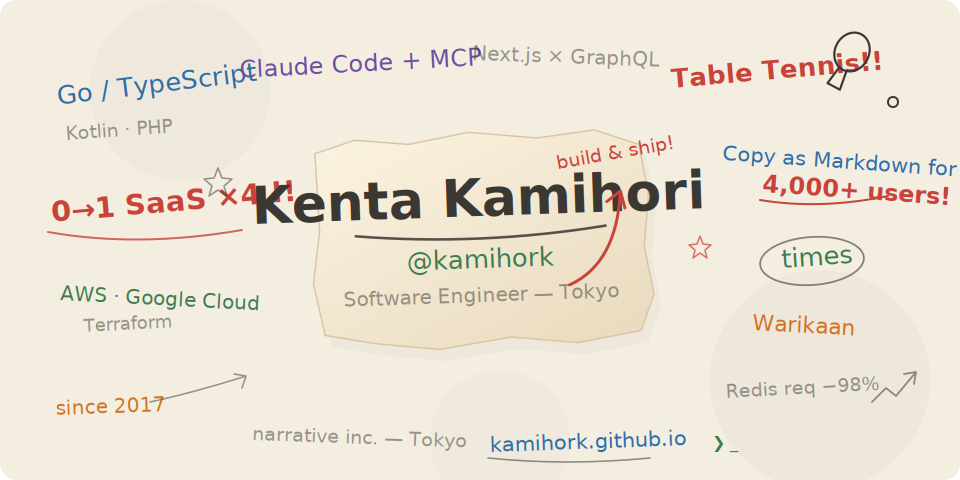

  

  <a href="https://kamihork.github.io/">Website</a> ·
  <a href="https://x.com/kamihork">X</a> ·
  <a href="https://zenn.dev/kamihork">Zenn</a> ·
  <a href="https://qiita.com/kamihork">Qiita</a> ·
  <a href="https://note.com/kamihork">note</a> ·
  <a href="https://www.linkedin.com/in/kamihork/">LinkedIn</a>

  
  
  

### 📝 Latest posts

<!-- BLOG-POST-LIST:START -->
<!-- BLOG-POST-LIST:END -->

Zenn / Qiita / note の新着記事から毎朝自動更新

  
  

